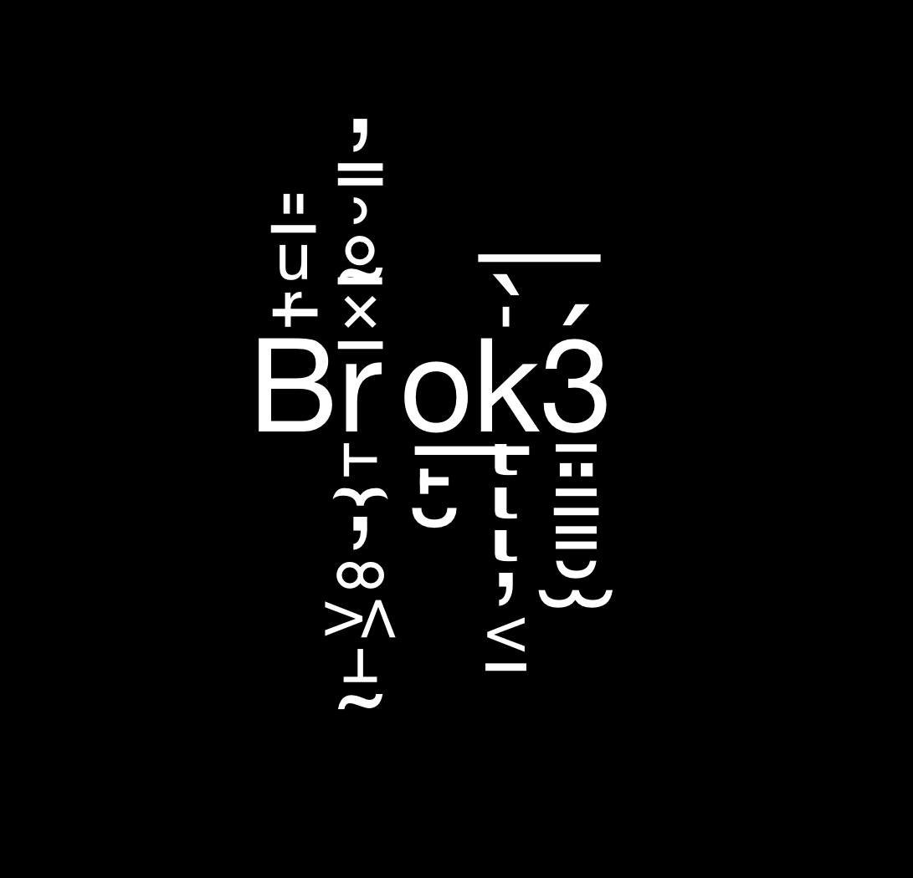

# Brok3 – Fullstack Developer & AI Innovator

## Profile

A highly motivated Fullstack Developer with a proven track record in web development, blockchain, 3D/VR/AR, and AI-driven solutions. With deep expertise in Python and JavaScript, I excel at delivering innovative projects—from scalable web applications to cutting-edge AI agents. Recognized as an early adopter of ChatGPT (first user, April 2021) and an active developer of AI agents since 2023, I bring a unique blend of technical mastery and creative problem-solving to every project.

## Contact Information

- **Age:** 21  
- **Location:** Pattaya  
- **Email:** [brok3.dev@icloud.com](mailto:brok3.dev@icloud.com)  
- **GitHub:** [ProximaCA](https://github.com/ProximaCA)

## Professional Experience

### Freelance & Independent Projects
- **Web Development:**  
  Developed robust websites and single-page applications using HTML, CSS, and JavaScript frameworks (React, Vue, Next.js, Three.js). Built scalable backend systems with Node.js and Python Flask.
- **VR/AR Solutions:**  
  Engineered immersive applications with Blender for 3D modeling and Unity (UI/UX, C#) for interactive experiences.
- **Blockchain & Smart Contracts:**  
  Designed and implemented smart contracts using Solidity (ERC721, ERC404, ERC521), developed small DApps, tokens, and NFTs, and performed smart contract audits.
- **Telegram Bots & Automation:**  
  Created advanced Telegram bots using aiogram (v3.0/4.0) — including a “Diary + Psychotherapist” bot — and built automation tools with Selenium for website testing, registration workflows, and AI-powered content generation.
- **Automated Trading:**  
  Developed algorithmic trader and sniper bots to optimize trading strategies.
- **Notcoin Clicker Automation:**  
  Built a high-performance click automation tool that generated $1,000 in revenue, with a theoretical potential scalability up to $1,000,000.

### Company Experience
- **Alchemy (Student):**  
  Gained early industry exposure in a dynamic startup environment.
- **CognitionX (Main Developer):**  
  Leading core development on the platform, integrating AI solutions to enhance user experiences. [cognitionx.cloud](https://cognitionx.cloud/)
- **Lindy (Agent Builder):**  
  Developed intelligent agent systems to drive automation and innovation. [lindy.ai](https://www.lindy.ai/)
- **Argon (Agent Hackathon):**  
  Competed in hackathons showcasing expertise in AI agent development and creative problem-solving. [argon-ai.com](https://argon-ai.com/)

## Education

- **PGNIU, University (2021 – 2024):**  
  Major: Information Systems and Programming  
  Specialization: Programmer  
- **Additional Training:**  
  - Courses in Python & Node.js  
  - VR/AR Courses (2019–2021)  
  - OSINT and Sysadmin Training
- Awarded a certificate for 2nd place in the "Medvezhonok" Olympiad in 5th grade

## Technical Skills

- **Programming Languages:** Python, JavaScript  
- **Frontend:** React, Next.js  
- **Backend:** Express, Node.js, Nest.js  
- **Libraries & Tools:**  
  - **Python:** web3, aiohttp, requests, pandas, aiogram, etc.  
  - **JavaScript:** Express, pnpm, pm2, serve, code obfuscation tools  
  - **Development Tools:** Remix IDE, VS Code, Cursor, Blender, Visual Studio (C#)  
- **Server Administration:** Expertise in Linux server setup, hosting, and security  
- **Operating System:** Linux  
- **AI & Automation:** Early adopter of ChatGPT (first user, April 2021) and active developer of AI agents since 2023

## Soft Skills

- **Creativity:** Frequently recognized as an idea generator  
- **Teamwork:** Proven ability to collaborate effectively in team environments  
- **Multitasking:** Skilled at managing multiple projects simultaneously

## Interests & Additional Information

- **Favorite Books:** 📚 “Cryptonomicon”, “1984”, “The Richest Man in Babylon”  
- **Favorite Films/TV Shows:** 🎬 “Limitless”, “Mr. Robot”, “Neon Genesis Evangelion”  
- **Languages:** English (B1 level)

## Portfolio

- **GitHub:** [ProximaCA](https://github.com/ProximaCA)
